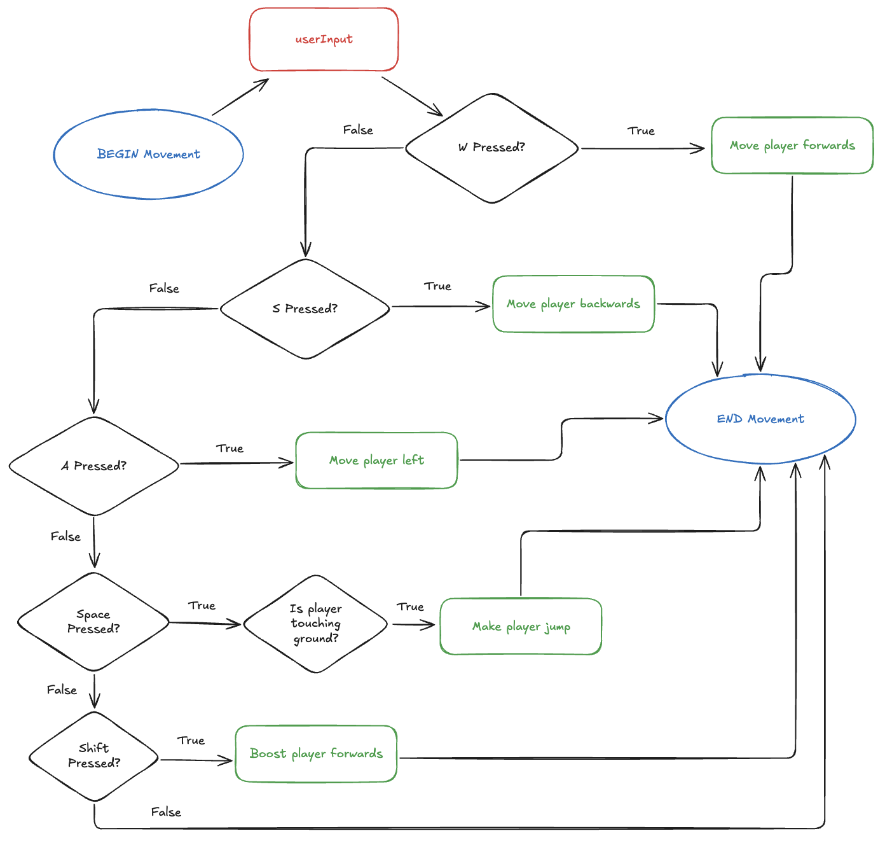
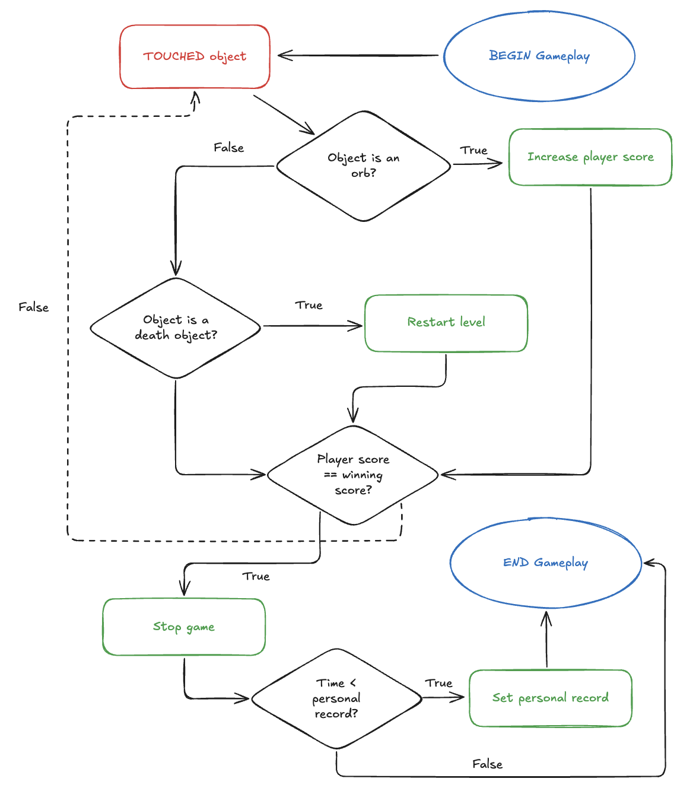
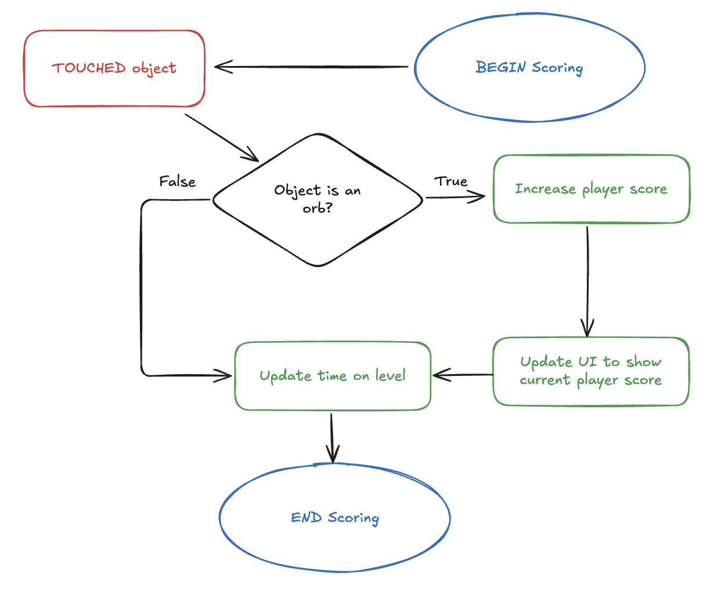
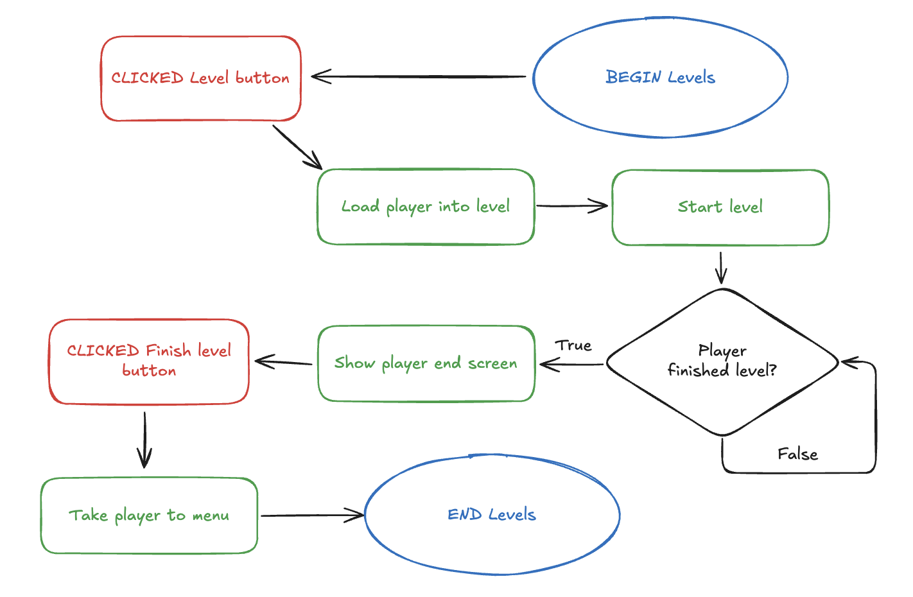
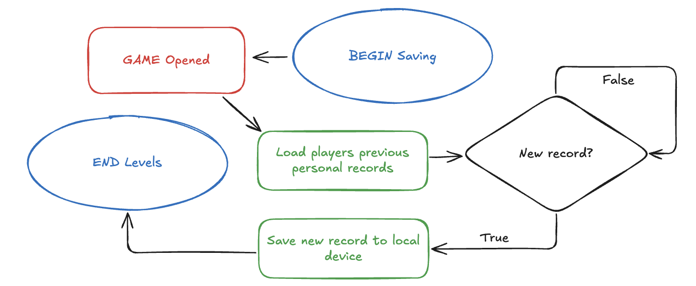
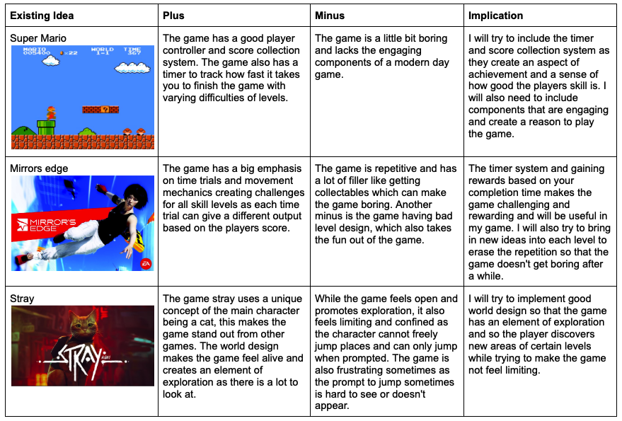

#  Proposal: 3D roll a ball puzzle platformer

## **Identifying and defining**

#### **identifying a need:** Increase the players thinking skills through a series of different puzzles and obstacles.

#### **Brainstorm:**

#### **Problem Statement:** Young children often need some sort of entertainment to keep them engaged with something. This ball rolling puzzle platformer will keep the player engaged while also increasing multiple skills including reaction time, problem solving, memory and fine motor control.

#### **Skill Development:** To develop the required skills for this Unity game, I will complete the rolling ball unity tutorial (https://learn.unity.com/project/roll-a-ball)

#### **Requirements Outline**
#### -Inputs: User inputs will inlcude WASD for directional movement, space to jump, escape to go to the menu, shift to boost the character forward and the mouse to look around.
#### -Processing: The program will need to check for collisions between objects, move the player based on the inputed key and update the players score.
#### -Outputs: The game will need to give visual feedback of the score, show a menu screen, a restart level screen and show the the character.
#### -Transmission: The game will not include any online capabilities.
#### -Storage: The game will store the players fastest time locally.

## **Functional Requirements**
#### -User Interation: The player will use WASD to control the movement of the character relative to the cameras position, the camera will be controlled by the players mouse, moving it left and right will move the camera acordingly. The escape key will pause the game and put a ui on the screen with multiple buttons that are clicked with the mouse.
#### Pseudocode:
#### BEGIN Movement
#### -----INPUT userinput
#### -----IF "W" pressed THEN
#### ----------Move player forwards
#### -----ELSE IF "S" pressed THEN
#### ----------Move player backwards
#### -----ELSE IF "A" pressed THEN
#### ----------Move player left
#### -----ELSE IF "D" pressed THEN
#### ----------Move player right
#### -----ELSE IF "Space" pressed THEN
#### ----------IF player touching ground THEN
#### ---------------Move player upwards
#### -----ELSE IF "Shift" pressed THEN
#### ----------Boost player forwards
#### END Movement

#### -Core Gameplay: The game will consist of moving a player around to solve puzzles and platform around a map to collect orbs that will increase the players score.
#### Pseudocode:
#### BEGIN Gameplay
#### -----TOUCHED object
#### -----IF object == orb THEN
#### ----------Add to players score
#### -----ELSE IF object == death object THEN
#### ----------Restart level
#### -----IF player score == winning number THEN
#### ----------Stop game
#### ----------IF time < personal record THEN
#### ---------------set personal record
#### END Gameplay

#### -Scoring and Feedback: The game will give feedback on the players score that can be achieved from collecting orbs around a level. There will be UI on the screen to show the players current score and time on the level.
#### Pseudocode:
#### BEGIN Scoring
#### -----TOUCHED object
#### -----IF object == orb THEN
#### ----------Add to players score
#### ----------Update UI to show current player score
#### -----UPDATE time on level
#### END Scoring

#### -Level Progression: The player will be able to choose the level without restriction from the menu screen. There will be a grid of buttons which represent the levels, clicking on one of them will start the level. After completing the level, an end screen will show and then a button will take them back to the menu.
#### Pseudocode:
#### BEGIN Levels
#### -----CLICKED level
#### -----Load player into level
#### -----Start level
#### -----IF player finished level THEN
#### ----------Show player end screen
#### ----------CLICKED finish level button
#### ----------Take player to menu
#### END Levels

#### -Saving and Loading Data: The game will save the players personal time record per level.
#### Psuedocode:
#### BEGIN Saving
#### -----GAME opened
#### -----load players previous personal records
#### -----IF new record THEN
#### ----------Save new record to local device
#### END Saving

## **Non-Functional Requirements**
#### Performance: The game should load within a few seconds, and recieve and respond to inputs instantly as the game should not feel unreliable and slow.
#### Usability: The game should include many features that will be easy for everyone to understand. The UI should be very straight forward with minimal, but enough buttons. A few repeatable tutorials should be included to teach the players the many game mechanics and how the game works, showing them the timer, how the orbs work, how to move, ect.
#### Compatability: The game must run on PC, and should run on mobile replacing the keys with digital touch controls. The game should support controller combatability aswell.
#### Scalability: The game should be able to scale with additional levels and more features, for example a global leaderboard, user created levels and character customisation.
#### Security: The user data stored, including high scores and game settings will be encrypted and stored securely to prevent others from accessing it.
#### Reliability and Availability: The game systems should almost always be available and accessable. Keeping old save data instead of deleting it would also be helpful in preventing data loss as if it occurs, you could revert to an older save.

## **Social and Ethical Issues**
#### **Definitions:**
#### Equity: The fairness between other people, where no matter peoples starting points, they can achieve similar outcomes to other people.
#### Accessiblity: The practice of creating an environment that can be used and accessed by everyone no matter their ability.

---

### **Accessibility**
#### The game should be accessible by people of all abilites, this can be achieved by adding features in the game settings like visual and audio customisability, and add changable keybinds so that people using other input devices can still access the game.

### **Privacy and Data Protection**
#### The game will collect user data like high scores and will securely stores localy on device with encryption to prevent others from accessing the data and to ensure high security. The game should also ask the player if they can store their data on device but should also warn them that if they do not allow it, it will have some negatives like no personal record saving or setting saving.

### **Fairness and Representation**
#### The game will avoid stereotypes and bias within the characters and scenes so that the player is not offended or harmed from things like gender, race or culture.

### **Mental and Emotional Well-Being**
#### The game will have little to no effect on the players wellbeing as their will be no distressing content like jumpscares or violence so that there is a positive experience while playing the game.

### **Culturual Sensitivites**
#### The game's content will not be offensive to any cultures. The content inside will be minimally misunderstood by players as there will be no offensive symbols or themes and just basic objects, and at the most a few hand drawn or self modelled game objects.

## **Evaluation of existing ideas**
### PMI:
