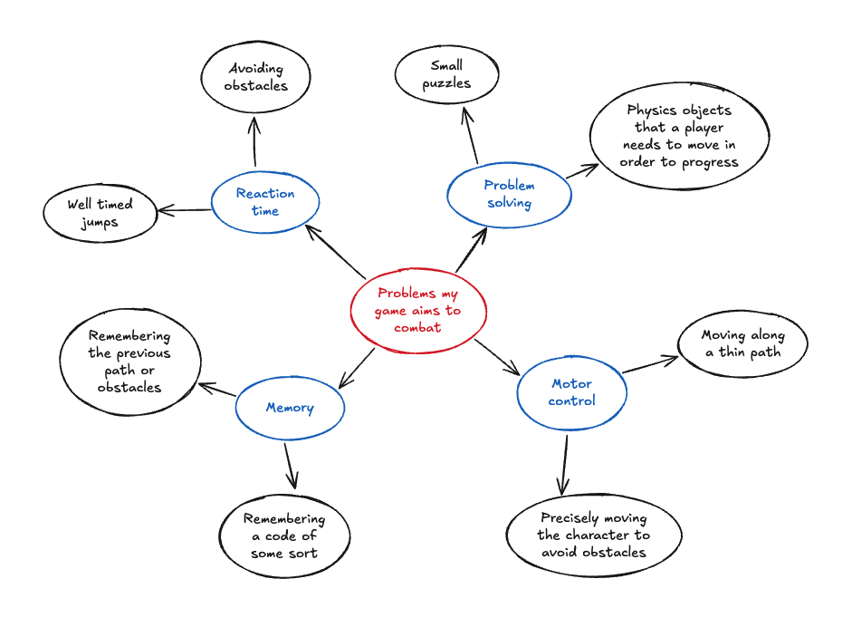
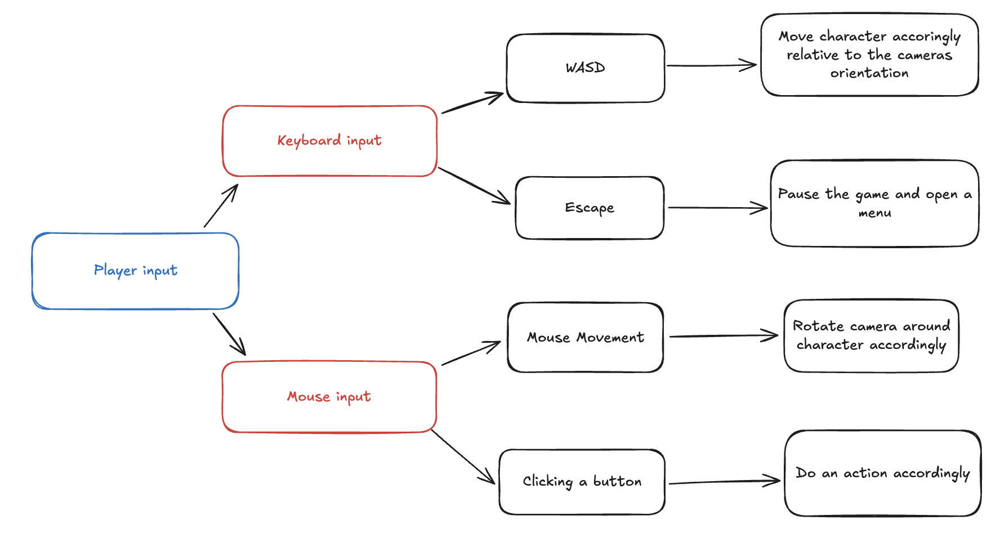

#  Proposal: 3D roll a ball puzzle platformer

## **Identifying and defining**

#### **identifying a need:** Increase the players thinking skills through a series of different puzzles and obstacles.

#### **Brainstorm:**

#### **Problem Statement:** Young children often need some sort of entertainment to keep them engaged with something. This ball rolling puzzle platformer will keep the player engaged while also increasing multiple skills including reaction time, problem solving, memory and fine motor control.

#### **Skill Development:** To develop the required skills for this Unity game, I will complete the rolling ball unity tutorial (https://learn.unity.com/project/roll-a-ball)

#### **Requirements Outline**
#### -Inputs: User inputs will inlcude WASD for directional movement, space to jump, escape to go to the menu, shift to boost the character forward and the mouse to look around.
#### -Processing: The program will need to check for collisions between objects, move the player based on the inputed key and update the players score.
#### -Outputs: The game will need to give visual feedback of the score, show a menu screen, a restart level screen and show the the character.
#### -Transmission: The game will not include any online capabilities.
#### -Storage: The game will store the players fastest time locally.

## **Functional Requirements**
#### -User Interation: The player will use WASD to control the movement of the character relative to the cameras position, the camera will be controlled by the players mouse, moving it left and right will move the camera acordingly. The escape key will pause the game and put a ui on the screen with multiple buttons that are clicked with the mouse.
-
#### -Core Gameplay: The game will consist of moving a player around to solve puzzles and platform around a map to collect orbs that will increase the players score.
